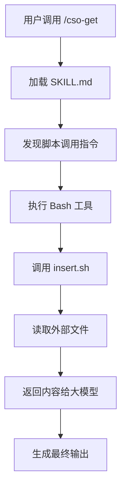

# CSO Skill 文件插入机制设计

## 设计背景

原始的 ->插入 依赖大模型识别，泛化能力弱。该设计未实现模板引擎，改为通过 Bash 脚本实现通用文件插入，实现"插入即调用"理念。

## 核心设计理念

### 1. 工具化而非语法糖
- 不使用特殊标记（如 ->插入）
- 直接调用 Bash 脚本，显式、明确
- 符合"工具调用优于魔法语法"原则

### 2. 可审计的插入链
```
SKILL.md → 调用 insert.sh → 读取目标文件 → 输出内容
     ↓           ↓              ↓           ↓
  声明式      工具化         物理文件     显式内容
```

### 3. 路径解析策略
- 绝对路径：直接使用
- 相对路径：相对于 skill 根目录解析
- 优势：脚本可在任何位置正确执行

## 架构对比

### 旧设计（已弃用）
```markdown
->插入 `references/syslawer/GB-01.md`
```
**问题**：
- 依赖大模型理解"插入"语义
- 不可复用
- 无错误处理
- 无版本追踪

### 新设计（Bash 脚本化）
```markdown
执行脚本：bash .claude/skills/cso-get/inject/insert.sh references/syslawer/GB-01.md
```

**优势**：
1. **标准化**：符合 Claude Code 工具调用规范
2. **可复用**：任何 skill 可使用同一脚本
3. **可调试**：独立运行机制，可单独测试
4. **可扩展**：支持章节提取、缓存等高级功能
5. **可审计**：调用链明确，日志可追溯

## 技术实现

### 调用语法
```bash
# 基础用法：插入完整文件
bash .claude/skills/cso-get/inject/insert.sh <文件路径>

# 高级用法：插入特定章节
bash .claude/skills/cso-get/inject/insert.sh <文件路径> <章节关键词>

# 实际示例
bash .claude/skills/cso-get/inject/insert.sh references/syslawer/GB-01.md
bash .claude/skills/cso-get/inject/insert.sh references/syslawer/DD.md "唯一合法格式"
```

### 输出格式
```
--- 开始插入 [文件路径] ---
<文件内容>
--- 结束插入 [文件路径] ---
```

## 目录结构

```
.claude/
└── skills/
    └── cso-get/
        ├── SKILL.md                    # 主配置文件（调用脚本）
        └── inject/
            ├── insert.sh               # 核心插入脚本
            ├── CONFIG.md               # 配置说明
            ├── SCHEMA.md               # 设计文档
            └── refs/                   # 文件缓存目录（可选）
```

## 与 Claude Code 集成

### 使用场景
1. **Skill 初始化**：启动时读取规则库
2. **动态注入**：运行时按需插入外部内容
3. **版本控制**：规则文件独立管理

### 执行流程


## 未来扩展

### 1. 命名空间支持
```bash
# 通过 alias.conf 映射
bash insert.sh @GB-01  # 自动解析为完整路径
```

### 2. 多级缓存
```
insert.sh
  └─ refs/
      ├── GB-01.md.cache     # 内容缓存
      └── GB-01.md.meta      # 元数据（last-modified, md5）
```

### 3. 增量更新
```bash
# 支持 diff 模式
bash insert.sh references/syslawer/GB-01.md --diff v1.0
```

### 4. 条件插入
```bash
# 基于环境变量
bash insert.sh references/syslawer/GB-01.md --if "$ENV=production"
```

## 维护建议

1. **版本管理**：
   - 规则文件使用 Git LFS 管理
   - SKILL.md 记录依赖版本

2. **测试**：
   ```bash
   # 测试插入脚本
   cd .claude/skills/cso-get
   bash ./inject/insert.sh references/syslawer/GB-01.md
   ```

3. **监控**：
   - 记录插入失败日志
   - 监控文件变更频率

4. **文档同步**：
   - SCHEMA.md 与代码同步更新
   - CONFIG.md 记录实际配置

## 设计总结

该设计通过 Bash 脚本的**显式调用**，实现了：

✓ **标准化**：符合工具调用规范
✓ **可复用**：跨 skill 共享
✓ **可调试**：独立运行
✓ **可审计**：调用链清晰
✓ **可扩展**：支持章节提取

**核心理念**：插入操作必须被显式声明，不能被隐含在魔法语法中。
